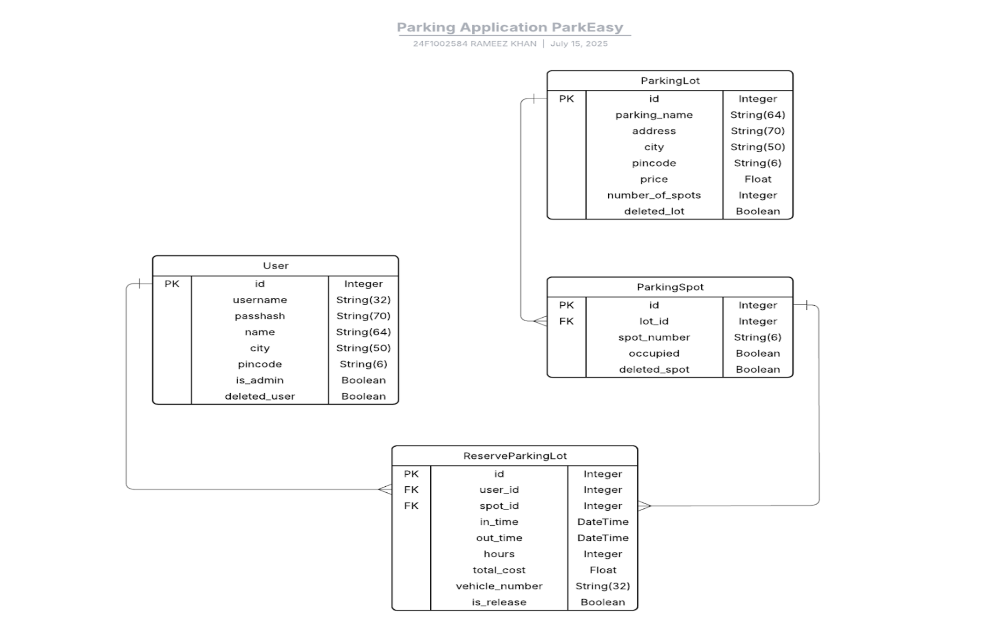

# ParkEasy – Smart Parking Management System 🚗📊

**Author:** Rameez Khan  
**Email:** [rameezk2215@gmail.com](mailto:rameezk2215@gmail.com)  
**Institute:** IIT Madras – B.Sc. in Data Science and Applications  

I am currently pursuing my B.Sc. from IIT Madras while working full-time as a Lead Data Analyst at S&P Global. My experience in data analytics and passion for web development led me to create ParkEasy—a full-stack smart parking system with an efficient backend and an intuitive frontend interface.

---

## 🚀 Project Overview

**ParkEasy** is a full-stack web application for managing parking spaces. It supports **User** and **Admin** roles with distinct functionalities such as:

- Real-time parking spot reservation
- Reservation history tracking
- Parking lot management
- Analytics dashboards using Chart.js

The system is developed with **Flask** for the backend and leverages **Jinja2**, **HTML/CSS/JS**, and **Chart.js** on the frontend.

---

## 🛠️ Technologies & Libraries

| Technology / Library      | Purpose & Functionality |
|---------------------------|-------------------------|
| Python (Flask)            | Backend routing and logic |
| Flask-SQLAlchemy          | ORM for database models and operations |
| SQLite                    | Lightweight relational database |
| Jinja2                    | Dynamic HTML templating |
| Chart.js                  | Responsive dashboard charts |
| HTML, CSS, JavaScript     | Frontend development |
| Werkzeug                 | Secure password hashing |
| python-dotenv             | Load environment variables securely |
| Flask utilities           | `render_template`, `request`, `flash`, `redirect`, `url_for`, `session` |
| functools.wraps           | Custom decorators for authentication |
| SQLAlchemy functions      | `func`, `case`, `extract`, `or_`, `cast`, `joinedload` for optimized queries |
| datetime                  | Date/time handling for bookings |
| math.ceil                 | Billing duration rounding |
| collections.defaultdict   | Grouping analytics data |

---

## 🧩 Database Schema



### 🧑 User Table
- `id`, `username`, `passhash`, `name`, `city`, `pincode`, `isadmin`, `deleted_user`

### 🅿️ ParkingLot Table
- `id`, `parking_name`, `address`, `city`, `pincode`, `price`, `number_of_spots`, `deleted_lot`

### 🔢 ParkingSpot Table
- `id`, `lot_id`, `spot_number`, `occupied`, `deleted_spot`

### 📄 ReserveParkingLot Table
- `id`, `user_id`, `spot_id`, `in_time`, `out_time`, `hours`, `total_cost`, `vehicle_number`, `is_release`

🛠 **Custom Methods**  
Example: `spot_detail(self, input)` returns active reservation and user details for a spot.

📐 **Design Decisions**
- **Normalized schema** ensures efficiency.
- **Soft deletes** preserve historical data while hiding from UI.

---

## 🧭 Routing & Application Design

The application uses Flask's built-in routing and server-side rendering (no REST APIs).

### 📌 Major Routes

| Route                     | Functionality                          |
|--------------------------|----------------------------------------|
| `/register`, `/login`, `/logout` | User authentication |
| `/home`                  | Show available parking lots |
| `/create_lot`, `/update_lot`, `/delete_lot` | Admin lot management |
| `/show_spot/<lot_id>`    | View available spots in a lot |
| `/active_booking`, `/booking_history` | View bookings |
| `/active_booking_post/<lot_id>` | Reserve a spot |
| `/release_spot/<booking_id>` | End a booking |
| `/users_list`            | Admin user list view |
| `/dashboard`             | Charts and analytics |
| `/profile`               | Update profile info |

---

## 📁 Project Structure

```
project/
│
├── app.py                 # App init & config
├── config.py              # Environment & DB settings
├── models/
│   └── models.py          # SQLAlchemy models
├── controllers/
│   └── routes.py          # Flask routes
├── templates/             # Jinja2 HTML templates
├── static/                # CSS, JS, images
└── .env                   # Environment variables (not committed)
```

---

## 🔑 Key Features

- 🔐 **Authentication & Security:** Password hashing via `Werkzeug`
- 🧑‍💼 **Role-Based Access:** Separate views for Admin and Users
- ❌ **Soft Deletes:** Data never lost permanently
- 📚 **Booking History:** View, manage, and analyze reservations
- 🔍 **Search Filters:** For parking lots, users, and bookings
- 📊 **Dashboard Charts:** Built with Chart.js for booking trends
- 🧾 **Flash Messaging:** Real-time UI feedback
- ✏️ **Profile Management:** Update user info and password

---

## ✅ Summary

**ParkEasy** is a modular, scalable, and efficient parking management system with a strong backend and user-friendly frontend. Using Flask’s native tools and libraries like SQLAlchemy, Chart.js, and Jinja2, the system delivers a robust experience for both users and admins.

---

## 📷 Screenshots

_Add screenshots of your login page, dashboard, spot booking UI, and analytics charts here (if applicable)._

---

## 📄 License

This project is built as part of IIT Madras’ MAD1 coursework. No commercial use intended.